# Informe Institucional y Comparativo Saber 11 (ICFES)
## Institución Educativa Juan Bautista Migani – Jornada Mañana
### Evolución Histórica 2025 – 2026, Directorio Visual y Créditos de Autoría

---

### 1. Ficha Técnica Institucional

| Parámetro | Detalle |
| :--- | :--- |
| **Institución Educativa** | JUAN BAUTISTA MIGANI - JORNADA MAÑANA |
| **Código DANE** | 183001001598 |
| **Código ICFES del Plantel** | 019158 |
| **Desarrollo del Software** | **Ing. Drigoberto Parra Sierra** (Área de Apoyo de Sistemas) |
| **Licencia de Uso** | **Uso Educativo Gratuito** |
| **Población Evaluada 2026** | **79** estudiantes |
| **Población Evaluada 2025** | **85** estudiantes |
| **Matrícula SIMAT Grado 11 (2026)** | **89** estudiantes |
| **Fotografías Oficiales Vinculadas** | **75 / 79** estudiantes evaluados (95% de cobertura fotográfica) |
| **Archivos Fuente** | `183001001598_2026_3.xls`, `183001001598_2025_3 año 2025.xls`, `Fichas_Matricula.doc` |
| **Portal Web Interactivo** | `C:\Users\Daigo Book\Desktop\icfes 2026\index.html` |
| **Libro de Cálculo Consolidado** | `C:\Users\Daigo Book\Desktop\icfes 2026\analisis_detallado_icfes_2026.xlsx` |

---

### 2. Comparativa Histórica Institucional (2025 vs 2026)

```mermaid
xychart-beta
    title "Comparativo Promedios por Asignatura: 2025 vs 2026"
    x-axis ["Lectura Crítica", "Matemáticas", "Sociales", "Ciencias Naturales", "Inglés"]
    y-axis "Puntaje Promedio" 45 --> 58
    bar [54.08, 51.94, 50.35, 51.13, 52.04]
    bar [53.49, 50.51, 49.05, 50.04, 52.23]
```

#### Matriz de Variación Multianual:

| Indicador / Asignatura | Año 2025 | Año 2026 | Variación | Diagnóstico Pedagógico |
| :--- | :---: | :---: | :---: | :--- |
| **Puntaje Global Promedio** | **259.39** | **254.43** | **-4.96 pts** | Descenso leve atribuible a mayor dispersión en el grupo 11-3 y brecha en matemáticas. |
| **Puntaje Global Mediana** | **257.00** | **252.00** | **-5.00 pts** | El 50% de la promoción 2026 se ubicó sobre los 252 puntos. |
| **Puntaje Máximo Colegio** | **370 pts** | **404 pts** | **+34 pts ★** | **Récord Histórico Institucional**: Jeremy Joel Moreno superó los 400 puntos (Top 1% de Colombia). |
| **Lectura Crítica** | **54.08** | **53.49** | **-0.59 pts** | Se mantiene estable y sigue siendo la materia más sólida del plantel (0% en Nivel 1). |
| **Matemáticas** | **51.94** | **50.51** | **-1.43 pts** | Retroceso moderado provocado por la brecha de género (-6.04 pts en alumnas). |
| **Sociales y Ciudadanas** | **50.35** | **49.05** | **-1.30 pts** | 🔴 **Área Crítica**: Cae por debajo del umbral de 50 puntos y concentra 75.9% en Niveles 1 y 2. |
| **Ciencias Naturales** | **51.13** | **50.04** | **-1.09 pts** | Descenso leve; requiere refuerzo en competencias de indagación e hipótesis. |
| **Inglés** | **52.04** | **52.23** | **+0.19 pts** | 🟢 **Única asignatura que mostró incremento positivo** frente al año anterior. |
| **Evaluados Totales** | 85 | 79 | -6 alumnos | 6 estudiantes evaluados menos en 2026. |
| **Estudiantes > 300 Puntos** | 19 (22.4%) | 10 (12.7%) | -9 alumnos | Reducción en la franja superior que amerita plan pre-ICFES temprano. |

---

### 3. Cuadro de Honor 2026 (Podio con Fotografías Oficiales)

> [!TIP]
> **Hito Académico 2026**: Jeremy Joel Moreno Gualdron rompió la marca de la institución logrando **404/500**, obteniendo **100/100 perfecto** en Lectura Crítica y **100/100 perfecto** en Inglés.

| Puesto | Fotografía | Estudiante | Salón | Global 2026 | Lec. | Mat. | Soc. | Cie. | Ing. | Decil Nac. |
| :---: | :---: | :--- | :---: | :---: | :---: | :---: | :---: | :---: | :---: | :---: |
| **1°** | `1028402567.jpg` | **JEREMY JOEL MORENO GUALDRON** | 11-3 | **404** | 100 | 72 | 70 | 75 | 100 | 100 (Top 1%) |
| **2°** | `1117933360.jpg` | **MANUELA PORTILLA BALLESTEROS** | 11-1 | **350** | 74 | 66 | 73 | 65 | 75 | 99 |
| **3°** | `1064837408.jpg` | **JUAN ANGEL GUERRERO CARDENAS** | 11-2 | **338** | 65 | 69 | 65 | 66 | 83 | 98 |
| **4°** | `1114004015.jpg` | **LUIS GABRIEL PORTELA GARCIA** | 11-3 | **329** | 64 | 66 | 68 | 66 | 63 | 96 |
| **5°** | `1117522168.jpg` | **ANDRES MAURICIO BERMEO CALDERON** | 11-3 | **322** | 67 | 68 | 61 | 65 | 55 | 94 |
| **6°** | `1117935001.jpg` | **SANTIAGO ALVAREZ CARDOZO** | 11-1 | **317** | 64 | 63 | 62 | 63 | 67 | 93 |
| **7°** | `1029561005.jpg` | **EHINY JULIANA CABRERA ASCENCIO** | 11-1 | **315** | 63 | 68 | 58 | 62 | 67 | 92 |
| **8°** | `1029560715.jpg` | **JERONIMO ROBLES HURTADO** | 11-1 | **311** | 61 | 66 | 61 | 55 | 79 | 90 |
| **9°** | `1118367530.jpg` | **MIGUEL ANGEL BERMEO PIZO** | 11-2 | **310** | 64 | 56 | 65 | 64 | 60 | 90 |
| **10°** | `1117515985.jpg` | **JANNA URIBE GAITAN** | 11-3 | **301** | 57 | 61 | 64 | 59 | 60 | 87 |

---

### 4. Diagnóstico por Asignaturas y Plan Curricular de Refuerzo

1. **Sociales y Ciudadanas (Prioridad 1 - Crítica)**:
   - Pasó de 50.35 en 2025 a 49.05 en 2026.
   - 75.9% de los alumnos en Niveles 1 y 2.
   - Refuerzo en: Constitución Política (mecanismos de protección de derechos, ramas del poder público) y análisis de fuentes multiperspectivistas.
2. **Matemáticas (Prioridad 2 - Alta por Brecha)**:
   - Pasó de 51.94 en 2025 a 50.51 en 2026.
   - Marcada brecha de género (-6.04 puntos en mujeres).
   - Refuerzo en: Razonamiento cuantitativo, proporcionalidad, regla de tres compuesta, áreas y volúmenes, y lectura de diagramas estadísticos.
3. **Ciencias Naturales (Prioridad 3 - Moderada)**:
   - Pasó de 51.13 en 2025 a 50.04 en 2026.
   - 70.9% en Niveles 1 y 2.
   - Refuerzo en: Identificación de variables en experimentos, formulación de hipótesis científicas y leyes de la conservación.
4. **Inglés (Oportunidad de Crecimiento)**:
   - Creció de 52.04 a 52.23 (+0.19).
   - El 38% está en A- (nivel pre-básico). Debe focalizarse en vocabulario funcional (partes 1 a 4).
5. **Lectura Crítica (Fortaleza)**:
   - Mantiene estabilidad en 53.49 (0% en nivel 1). Fomentar lectura intertextual para elevar estudiantes del Nivel 3 al Nivel 4.

---

### 5. Estudiantes en Refuerzo Prioritario (17 Casos) y Ausentismo SIMAT (11 Casos)

* **Refuerzo Prioritario (Puntaje < 220 o múltiples materias en Nivel 1)**:
  - 17 estudiantes individualizados en el informe y en el portal web (con foto, número de documento y áreas críticas a nivelar).
* **Ausentismo en la Prueba (11 Alumnos Matriculados en SIMAT sin resultado)**:
  - Identificados con nombre, cédula/tarjeta y teléfono en la pestaña *No Evaluados* del portal web y en el Excel para citación formal por secretaría académica.

---

### 6. Créditos de Autoría y Licencia Institucional

* **Autor y Desarrollador**: **Ing. Drigoberto Parra Sierra**
* **Dependencia**: Área de Apoyo de Sistemas e Informática – Institución Educativa Juan Bautista Migani (Florencia, Caquetá).
* **Licenciamiento**: **Uso Educativo Gratuito** sin fines de lucro, desarrollado en beneficio de la comunidad docente, directiva, estudiantil y de padres de familia.
* **Stack Tecnológico**: HTML5, Tailwind CSS, Chart.js, Lucide Icons, Python OpenPyXL.
